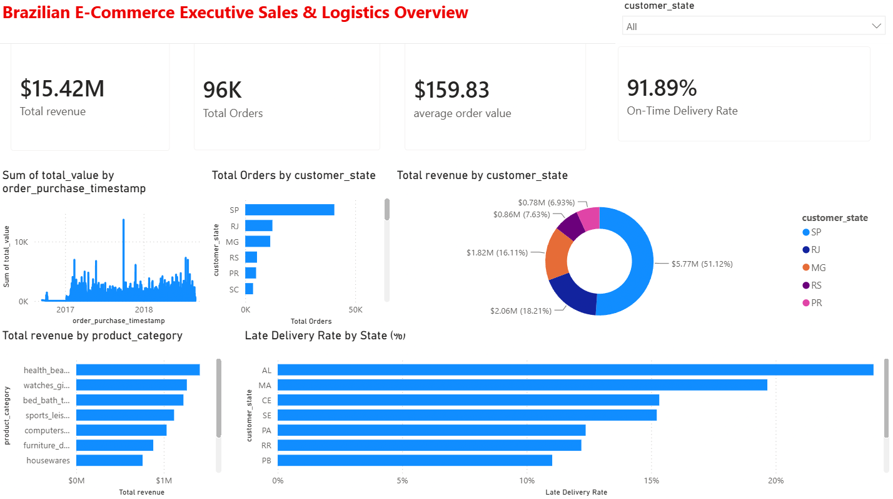

# 🛒 Brazilian E-Commerce End-to-End Analytics & BI Platform


An end-to-end data analytics and business intelligence solution processing over **110,000+ customer transactions** from the Brazilian E-Commerce marketplace (Olist). The project encompasses exploratory data analysis (EDA), data cleaning in Python, complex SQL window and aggregation queries, and an interactive executive Power BI dashboard.

---

## 📊 Executive Dashboard Preview



---

## 🎯 Executive Business Summary

| Key Metric | Value | Core Insight |
| :--- | :--- | :--- |
| **Total Revenue** | **$15.42M** | Driven primarily by health & beauty, watches/gifts, and bed & bath categories. |
| **Total Orders** | **96,000** | High order volume with peak seasonal surges during late Q4 (Black Friday). |
| **Average Order Value (AOV)** | **$159.83** | Consistent baseline spending across major metropolitan regions. |
| **On-Time Delivery Rate** | **91.89%** | Strong fulfillment baseline, though delivery delays spike in Northern states. |

---

## 🏗️ Project Architecture & Tech Stack

```text
├── data/
│   ├── raw/                 # Original Olist CSV datasets
│   └── processed/           # Cleaned and merged master dataset
├── notebooks/
│   └── 01_data_cleaning_eda.ipynb  # Pandas data transformations & EDA
├── sql/
│   ├── analysis_queries.sql # Window functions, RFM segmentation, MoM growth
│   └── olist.db             # (Ignored in Git) Local analytical SQLite database
├── powerbi/
│   ├── screenshots/         # Dashboard assets
│   └── retail_sales_dashboard.pbix  # Interactive report & DAX measures
├── .gitignore               # Excludes binary databases and cache
└── README.md                # Project documentation
